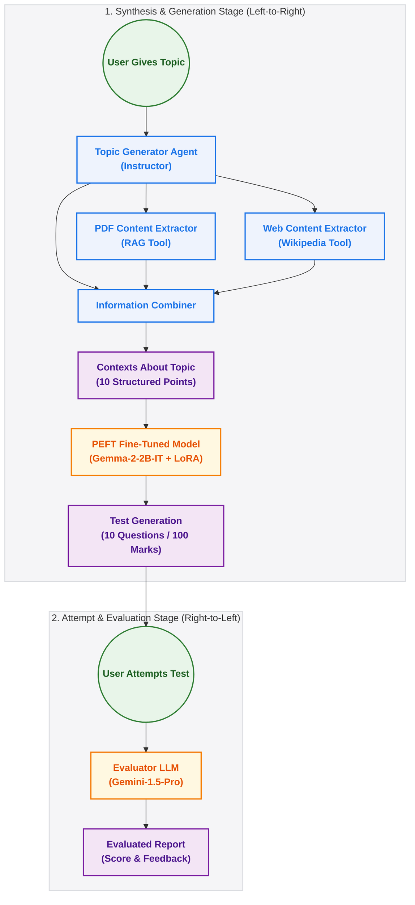

# TestGen: Autonomous Test Paper Generator & Evaluator

AI-Teacher is an agentic, end-to-end educational pipeline that automates the cycle of curriculum definition, custom test generation, and strict assessment. 

Instead of relying on generic prompt engineering, AI-Teacher integrates **CrewAI multi-agent orchestration** to gather context, a **custom-trained PEFT (LoRA) Gemma model** to generate context-specific exam questions, and **Gemini-1.5-Pro** to act as a strict professor evaluating student submissions with detailed feedback.

---

## System Flowchart

Here is how the information flows through the system, from the initial topic down to the evaluated report card:




---

## Architecture

The system is split into three main modules:

### 1. CrewAI Knowledge Synthesizer
When you input a topic (e.g., *Operating System Deadlocks*), a group of four specialized agents coordinate to build the knowledge foundation:
*   **Topic Generator Agent (Instructor)**: Outlines the necessary subtopics and concepts needed to fully understand the topic.
*   **PDF Content Extractor**: Uses a custom **RAG (Retrieval-Augmented Generation)** tool over your textbook/document (`context.pdf`) to pull highly relevant local technical details.
*   **Web Content Extractor**: Queries Wikipedia via a search tool to fill any knowledge gaps not covered in the local document.
*   **Information Combiner**: Takes the outputs of both extraction tasks, merges them, and generates exactly 10 distinct, detailed contexts covering the subtopics.

### 2. Custom PEFT Question Generator
Instead of using a generic LLM which might generate questions too easy, too hard, or out-of-format, we use a **fine-tuned Gemma-2-2B-IT** model. 
*   **Model**: [google/gemma-2-2b-it](https://huggingface.co/google/gemma-2-2b-it)
*   **Fine-Tuning Method**: LoRA (Low-Rank Adaptation) trained on 1,000 custom context-question pairs (`dataset.csv`).
*   **Role**: Converts each of the 10 context snippets into a highly specific, clean exam question.

### 3. Strict Grading Engine
Once the user attempts the test paper, their answers are passed to an evaluation module powered by **Gemini-1.5-Pro**. It grades the answers like a senior university professor, applying strict rubrics:
*   **Criteria**: Accuracy, Relevance, Completeness, and Clarity.
*   **Granular Feedback**: For each question, it provides marks, mistakes, missing concepts, suggestions, and an understanding level (e.g., *Average*, *Excellent*).
*   **Summative Report**: Generates overall statistics (Total Marks, Percentage, Strengths, Weaknesses, and final remarks).

---

## Repository Directory Structure

*   `notebooks/`
    *   [`teacher.ipynb`](notebooks/teacher.ipynb): The main system pipeline. Contains RAG database initialization, CrewAI orchestration, PEFT model loading, inference setup, and the complete interactive `Teacher` helper class.
    *   [`gemma_lora_training.ipynb`](notebooks/gemma_lora_training.ipynb): The training workbook showing how the base Gemma-2-2B-IT model is trained using `trl` and `peft` on the custom QA dataset.
*   `data/`
    *   `context.pdf`: Your core local knowledge source (e.g., textbook chapters, research papers).
    *   `dataset.csv`: The training dataset containing 1,000 QA context-question pairs.
*   `pyproject.toml` & `uv.lock`: Package declarations, dependency constraints, and lockfiles.

---

## Setup & Installation

### Prerequisites
*   Python **>= 3.10**
*   A CUDA-compatible GPU (strongly recommended for running the custom Gemma-2-2B-IT model locally).
*   API Keys:
    *   **Groq API Key**: For fast agent reasoning (Llama-3.3-70b).
    *   **Google Gemini API Key**: For the professor evaluation step.
    *   **Hugging Face Access Token**: To pull the base Gemma-2-2B model.

### 1. Clone the Project
```bash
git clone <your-repo-url>
cd ai-teacher
```

### 2. Install Dependencies
It is recommended to use `uv` for fast dependency management, but standard `pip` works too.

Using **uv**:
```bash
# Set up a virtual environment and sync dependencies
uv venv
uv pip install -r pyproject.toml
```

Using **pip**:
```bash
pip install -r pyproject.toml
```

### 3. Place Context Files
*   Put the document you want the agents to study into the `data/` folder and name it `context.pdf`.
*   Ensure your dataset for fine-tuning (`dataset.csv`) is present in `data/` if you plan to rerun the training.

### 4. Set Up Environment Variables
Create a `.env` file or export the following keys:
```bash
export GROQ_API_KEY="your-groq-api-key"
export GOOGLE_API_KEY="your-google-gemini-key"
export HF_TOKEN="your-huggingface-token"
```

---

## How to Run

### Interactive Usage (Main Pipeline)
The system is wrapped in a clean, stateful `Teacher` class inside [`notebooks/teacher.ipynb`](notebooks/teacher.ipynb). Here is how you can use it programmatically:

```python
from langchain_google_genai import ChatGoogleGenerativeAI
from notebooks.teacher import Teacher

# 1. Initialize the AI Teacher
teacher = Teacher()

# 2. Upload context PDF
teacher.upload_pdf("data/context.pdf")

# 3. Generate a 100-mark test on a specific topic
# This kicks off the CrewAI agents & passes the contexts to the PEFT question generator
topic = "Operating System Deadlocks"
test_paper = teacher.generate_test(topic)
print(test_paper)

# 4. Upload your answer sheet
# Assume you write your answers to a text file "answers.txt"
teacher.upload_answer_sheet("answers.txt")

# 5. Evaluate the answer sheet
evaluation_report = teacher.give_evaluation_report()
print(evaluation_report)
```

---

## Fine-Tuning the Question Generator (LoRA)

If you want to re-train or tweak the question generator:
1. Open [`notebooks/gemma_lora_training.ipynb`](notebooks/gemma_lora_training.ipynb).
2. Load the dataset from `data/dataset.csv`.
3. Configure the LoRA parameters:
   ```python
   peft_config = LoraConfig(
       r=8,
       lora_alpha=16,
       target_modules=["q_proj", "o_proj", "k_proj", "v_proj", "gate_proj", "up_proj", "down_proj"],
       lora_dropout=0.05,
       bias="none",
       task_type="CAUSAL_LM"
   )
   ```
4. Start SFT (Supervised Fine-Tuning) and save your model weight adapter.
5. In [`notebooks/teacher.ipynb`](notebooks/teacher.ipynb), load this adapter over the base `google/gemma-2-2b-it` model and run `model.merge_and_unload()` for optimized GPU inference.

---

## Sample Evaluation Report

The evaluation report generated by the Gemini professor follows a structured, professional format:

```markdown
# EVALUATION REPORT

## Question 1 (10 Marks)
*   **Question**: Explain the four necessary conditions for deadlock to occur.
*   **Marks Awarded**: 8/10
*   **Explanation**: The student correctly named Mutual Exclusion, Hold and Wait, No Preemption, and Circular Wait.
*   **Mistakes**: Did not explain how "No Preemption" works in the context of resource allocation.
*   **Missing Concepts**: Mention of resource preemption policies.
*   **Suggestions**: Add a brief sentence describing that resources cannot be forcibly snatched from a process.
*   **Understanding Level**: Good

...

## Overall Performance Summary
*   **Total Marks**: 82/100
*   **Percentage**: 82%
*   **Strengths**: Good grasp of basic definitions and conceptual terminology.
*   **Weaknesses**: Tends to omit resource allocation graphs and implementation details.
*   **Final Remarks**: Excellent effort. Focus on concrete OS mechanisms rather than purely abstract descriptions.
```

---
